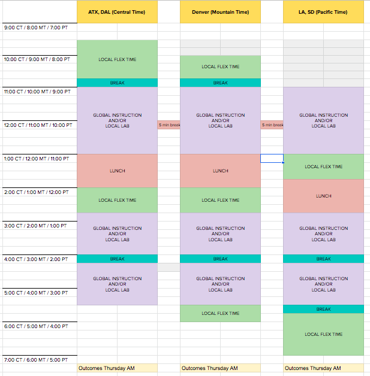

# SEI-CC-8 Local Lecture Repository

## This repository will contain useful information and resources for SEI-CC-8.

## To keep your Enterprise Github up to date with Global SEI-CC-7 (Do this at least once a day!):
```
git pull upstream master
git push
```
## To pull down the latest commit during a code-along lesson, use:
```
git fetch --all
git reset --hard origin/master
```

# Week 1 Useful Information:
## Daily Schedule:

# 
## Recorded Global lessons can be found [here](https://www.youtube.com/playlist?list=PL51l5r1uFLPOoHTAWQdr4EMpV5zbEPhDx). 
# 
## Recorded Local lessons are listed here:
<details>
<summary>Click to expand</summary>

# [Number Guessing Game - Part 1](https://drive.google.com/file/d/1beCMddmlE_XNXz1Q6X4kZWzh-OdIUD0B/view?usp=sharing).
# [Number Guessing Game - Part 2](https://drive.google.com/file/d/1MxI5YrtdMtcDZkrZ3V240Q6xlsGYsYbd/view?usp=sharing).

# [Creating a repository and adding files to it](https://drive.google.com/file/d/1Ue8av-BhAzhZ1lSuXmY8jAvM6xML6ZoW/view?usp=sharing).
</details>

# 
## SEI-CC-8 Class repository can be found [here](https://git.generalassemb.ly/SEI-CC/SEI-CC-8).
# 
## Install-fest for Macs can be found [here](https://git.generalassemb.ly/SEI-CC/SEI-CC-8/blob/master/work/w01/d1/02-installfest.md).
# 
## Install-fest for Linux(Ubuntu) can be found [here](https://docs.google.com/document/d/1q74Y_A6psCz_Ou_GNGlVAXQVA3bivIcMFl3HVOd4RiE/edit).
# 
## Deliverables can be submitted [here](https://docs.google.com/forms/d/e/1FAIpQLSegX4tgG7HjoCcOpxDGgzasg5K6qZq9rf9wMUIdNxs3IsCq5w/viewform).
# 
## CLI(Command Line Interface) command [cheat sheet](https://towardsdatascience.com/a-quick-guide-to-using-command-line-terminal-96815b97b955).
# 
## Git commands / workflow [cheat sheet](https://rogerdudler.github.io/git-guide/).
# 
## Useful VS Code Extensions:
<details>
<summary>Click to expand</summary>

:emojisense:  - Suggestions and auto-complete for emoji in VS Code

Beautify - Adds color to help identify different parts of your code

Better Comments - Create human-friendly comments in your code

Bracket Pair Colorizer - Colors brackets/parens for easy readability

Color Info - Provides quick info about CSS colors

Debugger for Chrome - Debug JavaScript in Chrome

Django - Beautifies syntax for Django code

EJS language support - Adds support for EJS to VS Code

ESLint - JavaScript linting

HTML Boilerplate - Provides shortcut for boilerplate template

Live Server - Launch a development server with live reload/refresh

Markdown All in One - Shortcuts/preview for markdown code

Markdown Emoji - Adds emoji support to markdown

Material Icon Theme - Adds different icons for differentiating file types

open in browser - Open current file in your default browser/application

Python - Linting/debugging/intellisense for Python

SQL Server (mssql) - Adds support for SQL linting/colorizing/intellisense

vscode-spotify - Allows Spotify control from within VS Code
</details>

## Week 1 Resources
<details>
<summary>Click to expand</summary>

## [Markdown Syntax Cheat Sheet](https://guides.github.com/pdfs/markdown-cheatsheet-online.pdf)

## [JavaScript Docs (MDN)](https://developer.mozilla.org/en-US/docs/Web/JavaScript)

## [JavaScript Data Types (MDN)](https://developer.mozilla.org/en-US/docs/Web/JavaScript/Data_structures)

## [JavaScript Control Flow (MDN)](https://developer.mozilla.org/en-US/docs/Web/JavaScript/Guide/Control_flow_and_error_handling)

## [JavaScript Arrays (MDN)](https://developer.mozilla.org/en-US/docs/Web/JavaScript/Reference/Global_Objects/Array)

## [JavaScript Functions (MDN)](https://developer.mozilla.org/en-US/docs/Web/JavaScript/Reference/Functions)

## [Understanding Scope in JavaScript](https://scotch.io/tutorials/understanding-scope-in-javascript)

## [JavaScript Objects (MDN)](https://developer.mozilla.org/en-US/docs/Web/JavaScript/Reference/Global_Objects/Object)

## [Template Literals (MDN)](https://developer.mozilla.org/en-US/docs/Web/JavaScript/Reference/Template_literals)

## [CSS Tricks](https://css-tricks.com/) - Great CSS resource
# 
## Helpful CSS Libraries:
## [Animate](https://daneden.github.io/animate.css/) - Great for beginners, check this out for tic-tac-toe effects!!!
## [Materialize](https://materializecss.com/) - AMAZING, you WILL use this!
## [Skeleton](http://getskeleton.com/)
## [Bootstrap](https://getbootstrap.com/) - AMAZING, you WILL use this!
## [Foundation](https://foundation.zurb.com/) - More advanced, but SUPER powerful
# 
## [Intro to the DOM (MDN)](https://developer.mozilla.org/en-US/docs/Web/API/Document_Object_Model/Introduction)

## [Intro to Events (MDN)](https://developer.mozilla.org/en-US/docs/Learn/JavaScript/Building_blocks/Events)

## [Event Handlers (MDN)](https://developer.mozilla.org/en-US/docs/Web/Guide/Events/Event_handlers)
</details>


## Week 2 Resources
<details>
<summary>Click to expand</summary>

## [CSS Flexbox (MDN)](https://developer.mozilla.org/en-US/docs/Web/CSS/CSS_Flexible_Box_Layout/Basic_Concepts_of_Flexbox)
## [Flexbox Froggy](https://flexboxfroggy.com/) - Use this to help learn Flexbox!!!
## [CSS Grid (MDN)](https://developer.mozilla.org/en-US/docs/Web/CSS/CSS_Grid_Layout)
## [Grid Garden](https://cssgridgarden.com/) - Use this to help learn Grid!!!
## [Responsive Design - Media Queries (MDN)](https://developer.mozilla.org/en-US/docs/Web/CSS/Media_Queries/Using_media_queries)
## [Callback Functions (MDN)](https://developer.mozilla.org/en-US/docs/Mozilla/js-ctypes/Using_js-ctypes/Declaring_and_Using_Callbacks)
## [JS Classes (MDN)](https://developer.mozilla.org/en-US/docs/Web/JavaScript/Reference/Statements/class)
## [jQuery (Docs)](https://api.jquery.com/)
## [Arrow Functions (MDN)](https://developer.mozilla.org/en-US/docs/Web/JavaScript/Reference/Functions/Arrow_functions)
## [this Binding (MDN)](https://developer.mozilla.org/en-US/docs/Web/JavaScript/Reference/Operators/this)
## [Playing Audio (MDN)](https://developer.mozilla.org/en-US/docs/Web/API/HTMLAudioElement/Audio)

</details>

## Unit 1 Project Resources
<details>
<summary>Click to expand</summary>

## [Documenting Your Projects on GitHub](https://guides.github.com/features/wikis/)
## [Wireframe.cc](https://wireframe.cc/) - Simple, easy to use wire-frame designer
## [Draw.io](https://www.draw.io/) - More robust wire-frame utility, has templates for ERD (Entity Relationship Diagram) that we'll use in Units 2, 3, and 4
## [Trello](https://trello.com/) - Organization site to help keep goals/objectives neat and tidy
## [Google Fonts](https://fonts.google.com/) - So. Many. Fonts.
## [confetti.js](https://github.com/mathusummut/confetti.js/) - Everybody loves confetti...
## [Cool JavaScript Effects](https://wpdatatables.com/cool-javascript-effects/) - Links to TONS of fun, easy to use JS resources
## [CSS/JS Text Animation Snippets](https://speckyboy.com/css-javascript-text-animation-snippets/) - Easy to use code snippets for text animation
## [Freesound](https://freesound.org/) - So. Many. Free. Sounds.


</details>

# 
## Coding Challenge Sites:
www.hackerrank.com

www.codewars.com

https://www.interviewcake.com/

https://adventofcode.com/

## Recommended podcasts:
Syntax

Command Line Heroes 

JS Party

Software Engineering Daily


