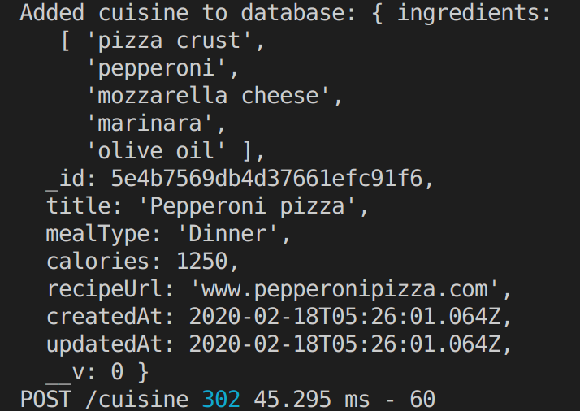

# Step-By-Step Instructions (with no code):
##  
### Step 1:  Navigate to the parent directory where you want to create your app.  Use the express generator to create your app's skeleton.
###  
### Step 2: Navigate into the directory and open in VS Code.

###  
### Step 3:  Open a terminal in VS Code.  Change the name of app.js to server.js.
###  
### Step 4:  Adjust the /bin/www file to reflect those changes so that your server will start properly.

###  
### Step 5:  Create directories for the model, controller, database (config), and views, then add the corresponding files within each.  (views/cuisine models/cuisine.js controllers/cuisine.js config/database.js)

###  
### Step 6:  Install node modlues and mongoose using npm.

###  
### Step 7:  Split the terminal at the bottom of VS Code to open a second window for monitoring the server.  Start the server using nodemon and test it out.

### When you browse to 'localhost:3000' you should see the generic express template.
##  
### Step 8:  Configure the database connection in database.

###  
### Step 9:  Require the database in the server.

###  
### Step 10:  Define the schema in the model.

###  
### Step 11:  Use the terminal to rename users.js --> cuisine.js.
###  
### Step 12:  Adjust the server to reflect the changes from the previous step.

###  
### Step 13:  Configure your router and define a route to create a new cuisine.

###  
### Step 14:  Add the controller.

###  
### Step 15:  Create a 'new' view page.
###  
### Step 16:  Create a form within the 'new' view for the user to add an item.

###  
### Step 17:  Add minimal CSS in public/stylesheets/style.css.

###  
### Step 18:  Define the POST route.

###  
### Step 19:  Create a controller for the route.

### Step 20:  Navigate to 'localhost:3000/new' in your browser.  Fill out the fields and hit the 'Add' button.  Check to make sure the POST request shows up in the terminal currently running the server:

###  
### Step 21:  Define a route for the index page.

###  
### Step 22:  Add the corresponding controller.

###  
### Step 23:  Use the terminal to create an 'index' view.
###  
### Step 24:  Add a button to add, along with a simple table using ejs in the newly created index.ejs:

###  
### Step 25:  Add some CSS to make it look a little nicer.

###  
### Step 26:  Change the default 'localhost:3000' landing page to redirect to 'localhost:3000/cuisine' now that it is properly displaying all items.  Do this by changing the route.

###  
### Step 27:  Add a route for the 'Details' button that was just created.

###  
### Step 28:  Add the controller for the new route.

###  
### Step 29:  Using the terminal, create a 'show' view page.
###  
### Step 30:  Write the HTML/ejs to display the data for an individual item in the show view.

###  
### Step 31:  Add some CSS to clean up the display.
###  

### Step 31.5:  Use npm to install the method-override package:
### ...then require it in server.js:
### ...and add it to the middleware:
###  

### Step 32:  Add a button to handle deletion.

###  
### Step 33:  Add the route to handle deletions.

###  
### Step 34:  Add the corresponding controller.

###  
### Step 35:  Add a button to handle updating an item.

###  
### Step 36:  Add the route to handle showing the update page.

###  
### Step 37:  Add the corresponding controller.

###  
### Step 38:  Using the terminal, create an 'update' view.
###  
### Step 39:  Copy the form over from show.ejs to update.ejs, but modify it to auto-populate the values of each field with the current record's info.

###  
### Step 40:  Add the POST route to send the record to be updated.

###  
### Step 41:  Add the corresponding controller.

###  
### Step 42:  Profit.
